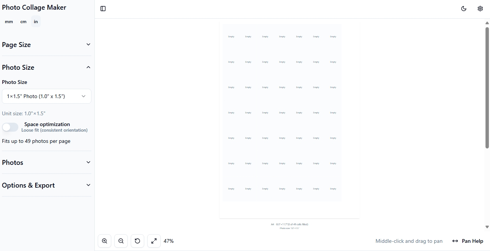

# LayoutCrafter

Easily arrange and print multiple images or designs on a single page with automatic cutting markers.

**Tagline:** Print smart. Cut easy.

## Screenshots

| **Initial Layout**                                                | **Photo Size**                                                   | **Photo selector**                                              |
| ----------------------------------------------------------------- | ---------------------------------------------------------------- | --------------------------------------------------------------- |
|  |  |  |

| **Export Options**                                             |
| -------------------------------------------------------------- |
|  |

| **Settings**                                                | **Photo Presets**                                                      | **Page Presets**                                                     |
| ----------------------------------------------------------- | ---------------------------------------------------------------------- | -------------------------------------------------------------------- |
|  |  |  |

---

## Technology Stack

This project is built with:

- Vite
- TypeScript
- React
- **shadcn-ui**
- Tailwind CSS
- Zustand
- React DnD
- Lovable

---

## Started and prototyped with [Lovable](https://lovable.dev/projects/de92518e-47c2-42b5-a3d3-314649c6bf05)

## Inspiration

I always wanted a go-to app for arranging and printing multiple images on a single page, with automatic cutting markers, instead of manually adding markers and creating layouts in image editors. One day, I created a prototype with Lovable, and it worked so well that I kept improving it and now use it for myself.

---

## Project Directory Structure

- `/src/` — Main source code
  - `components/` — All React UI components (ExportPanel, PresetManager, SettingsDialog, etc.)
  - `context/` — React context for global state (CollageContext)
  - `data/` — Preset data for layouts and page sizes
  - `hooks/` — Custom React hooks (e.g., use-canvas-controls for mouse/keyboard canvas control)
  - `lib/` — Utility libraries (unit conversion, canvas rendering, etc.)
  - `stores/` — Zustand stores for presets and state management
  - `types/` — TypeScript types for collage, settings, etc.
  - `index.css` — Tailwind and custom CSS
- `/public/` — Static assets (icons, manifest, logo)
- `index.html` — Main HTML entry point
- `package.json` — Project dependencies and scripts
- `tailwind.config.ts` — Tailwind CSS configuration

---

## Key Ingredients & Important Code Parts

- **Canvas Rendering**: `/src/lib/canvas-renderer.ts` handles rendering the collage, cells, images, and cutting markers, including export compatibility (color conversion, DPI scaling).
- **ExportPanel**: `/src/components/ExportPanel.tsx` provides export to PNG (with DPI metadata), PDF, and direct print, with custom DPI and scale controls.
- **Preset Management**: `/src/components/PresetManager.tsx` and `/src/stores/preset-store.ts` allow creating, editing, duplicating, importing/exporting, and reordering custom page and photo size presets.
- **Settings**: `/src/components/SettingsDialog.tsx` manages global preferences, backup/restore, and default behaviors.
- **Mouse & Keyboard Controls**: `/src/hooks/use-canvas-controls.ts` enables zoom, pan, and fit-to-container with mouse and keyboard shortcuts (spacebar for pan, ctrl+wheel for zoom, etc.).
- **Unit Conversion**: `/src/lib/unit-converter.ts` supports mm, cm, and inches throughout the app.
- **Custom Preset Dialog**: `/src/components/ui/custom-preset-dialog.tsx` for creating new page/photo sizes with unit parsing.
- **Theme & Color System**: `/src/index.css` and Tailwind config use CSS variables and oklch/hsl color spaces for light/dark themes.

---

## Features

- **Drag & Drop Layout**: Arrange images in a grid with custom page and photo sizes.
- **Cutting Markers**: Automatic, precise cutting guides with customizable colors.
- **Export Options**: Export your layout as high-DPI PNG (with correct DPI metadata), PDF, or send directly to print.
- **Custom Presets**: Create, edit, duplicate, import/export, and reorder your own page and photo size presets.
- **Mouse & Keyboard Controls**: Zoom (ctrl+wheel), pan (space+drag or middle mouse), fit-to-container, and more.
- **Unit Support**: Work in mm, cm, or inches everywhere.
- **Theme Support**: Light and dark mode with modern color system.
- **Backup & Restore**: Export/import all settings and presets for easy migration or sharing.
- **Auto-save**: Optionally auto-save your project changes.
- **Responsive UI**: Works well on various screen sizes.

---
